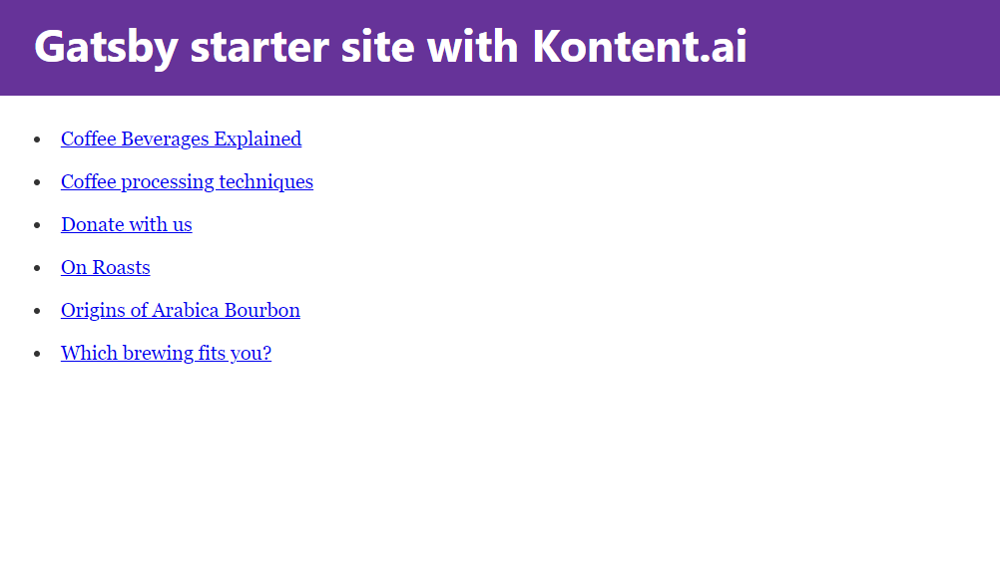

# Gatsby starter site with Kontent.ai

This repo contains a Gatsby starter site pre-configured with [Kontent.ai](https://kontent.ai/) [source plugin](https://www.npmjs.com/package/@kontent-ai/gatsby-source). The site portrays a list of articles written by a coffee shop called dancing goat.

## Prerequisites

* [Node.js](https://nodejs.org/) with NPM installed

## How to run the code

The preferred way is to use Gatsby CLI `gatsby new` command, but you can of course simply clone or fork this repo.

### Use Gatsby CLI

Make sure you have Gatsby CLI installed via `npm list -g gatsby-cli`. If not, you can install CLI via `npm install --global gatsby-cli`.

Then, navigate to your projects directory and run `gatsby new [subdirectory name] https://github.com/kontent-ai/gatsby-starter`. Replace `[subdirectory name]` with your project directory's name. The CLI tool will essentially do three things:

* create a subdirectory
* clone the starter site code files into that subdirectory
* run `npm install` to get all dependencies for you
  * that also copies content from `.env.template` to newly created `.env` file using `prepare` npm script

### Clone or fork the repo

[Clone](https://git-scm.com/docs/git-clone) or [fork](https://hub.github.com/hub-fork.1.html) this repo. Once it's done, navigate to the [app's root directory](https://github.com/kontent-ai/gatsby-starter) and run:

`npm install`

### Run the starter site

Now, run:

`npm run develop` (or `gatsby develop`, should you have the Gatsby CLI installed)

This will bootstrap the site, build all static pages and start the site at <http://localhost:8000> . You'll also be able to test arbitrary GraphQL queries in the GraphiQL interface via <http://localhost:8000/___graphql>.

## Developing

You may use any IDE, however, we recommend [Visual Studio Code](https://code.visualstudio.com/) as we have added a [settings file](https://github.com/kontent-ai/gatsby-starter/blob/master/.vscode/launch.json) for easier debugging.

### Get to the content source

1. Go to [app.kontent.ai](https://app.kontent.ai) 
1. Click on the account icon and click on the `projects`
1. Select Sample Project. If there is not any, there should be a card with an option to create it. 
1. Set environment variables to `.env` (created automatically by running `npm install`)
    * `KONTENT_PROJECT_ID` from Go to "Project Settings" -> "API keys" -> "Project ID"
    * `KONTENT_LANGUAGE_CODENAMES`  from "Project Settings" -> "Localization" (use "Codename" of each language)

### Retrieve both published and unpublished content

To load data from [Preview API](https://docs.kontent.ai/reference/delivery-api#section/Production-vs.-Preview) just set the following environment variables to your `.env` file (created automatically by running `npm install`)

* `KONTENT_PREVIEW_KEY` from Go to "Project Settings" -> "API keys" -> "Preview API" -> "Primary key/Secondary key"
* `KONTENT_PREVIEW_ENABLED` to `true`

### Experimenting

Of all the artifacts of Kontent.ai, the starter site only displays content items and only in the default language. But, our [source plugin](https://github.com/kontent-ai/gatsby-packages/tree/master/packages/gatsby-source) also provides content types and items in non-default languages.

Check out the [source plugin's readme](https://github.com/kontent-ai/gatsby-packages/tree/master/packages/gatsby-source#readme) for more details on which kinds of data and relationships it supports.
